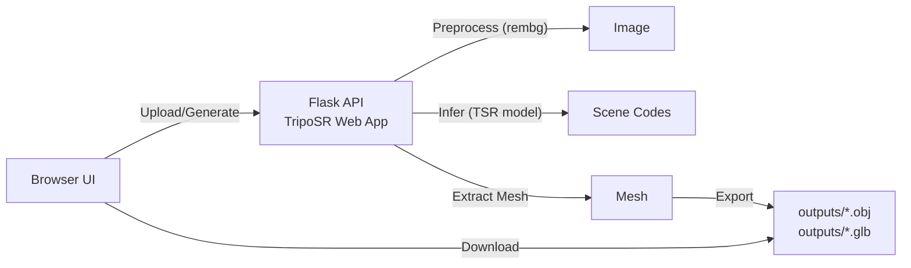

# 2D Image → 3D Web App


Convert a single image into a downloadable 3D model (OBJ/GLB), locally and privately. The app integrates Stability’s TripoSR for fast, high-quality mesh reconstruction and provides a modern in-browser UI with optional QR-code mobile uploads.

- **Input**: 1–4 images (the first is used for 3D generation)
- **Output**: OBJ and GLB files in `outputs/`
- **Extras**: Background removal, mesh resolution control, QR upload flow


## Table of contents
- [Features](#features)
- [Architecture](#architecture)
- [Quick start (Flask app)](#quick-start-flask-app)
- [Optional React demo](#optional-react-demo)
- [API endpoints](#api-endpoints)
- [Troubleshooting](#troubleshooting)
- [Project structure](#project-structure)
- [License](#license)
- [Acknowledgements](#acknowledgements)


## Features
- **Learning-based 3D reconstruction**: Uses [TripoSR by Stability](https://huggingface.co/stabilityai/TripoSR)
- **Background removal**: Built-in with `rembg`
- **Mesh resolution slider**: Balance speed and quality
- **Multiple export formats**: `OBJ` and `GLB`
- **Modern UI**: Tailwind-styled single-page interface
- **Mobile-friendly uploads**: Scan QR to upload photos from your phone
- **Local-first**: Runs entirely on your machine; images are not uploaded elsewhere


## Architecture


- Flask app entry: `TripoSR/web_app.py`
- Model loading: `TSR.from_pretrained("stabilityai/TripoSR")`
- Outputs written to `outputs/`


## Quick start (Flask app)
Prerequisites:
- Python 3.8+
- Internet access for first-run model download
- GPU optional (CPU works; GPU is much faster)

1) Install dependencies
```bash
# From the repo root
python -m venv .venv && source .venv/bin/activate  # Windows: .venv\\Scripts\\activate
pip install --upgrade pip

# Core requirements
pip install -r TripoSR/requirements.txt

# Runtime dependencies not pinned in requirements.txt
pip install flask flask-cors numpy

# Install PyTorch per your system (choose one)
# CPU only
pip install torch --index-url https://download.pytorch.org/whl/cpu
# Or visit https://pytorch.org/get-started/locally/ for the wheel that matches your CUDA
```

2) Run the server
```bash
python TripoSR/web_app.py            # Local only
# or to use QR uploads from phone on same network
python TripoSR/web_app.py --host 0.0.0.0 --port 5000
```

3) Open the app
- Local: [http://127.0.0.1:5000](http://127.0.0.1:5000)
- Network (QR flow): `http://<your-lan-ip>:5000`


## API endpoints
- **POST** `/api/upload`
  - Body: `{ image: <base64 data URL>, removeBackground?: boolean, foregroundRatio?: number }`
  - Response: `{ success: true, processedImage: <base64 data URL> }`

- **POST** `/api/generate`
  - Body: `{ processedImage: <base64 data URL>, mcResolution?: number }`
  - Response: `{ success: true, models: { obj: <base64>, glb: <base64> } }`

- **GET** `/api/download/{obj|glb}`
  - Downloads the latest file from `outputs/`

- **QR/mobile upload flow**
  - `POST /api/qr-upload-session` → returns `{ session_id, upload_url }`
  - `GET /mobile-upload/{session_id}` → mobile upload page
  - `POST /api/mobile-upload/{session_id}` → multipart image upload
  - `GET /api/check-qr-session/{session_id}` → polling status


## Troubleshooting
- "Torch not found" or CUDA issues: install the correct PyTorch wheel from the [official guide](https://pytorch.org/get-started/locally/).
- Missing packages: ensure `flask`, `flask-cors`, `numpy`, and `torch` are installed in your environment.
- Permission issues on `outputs/`: the app will create it if missing; otherwise create it manually.


## Project structure
```
ja assure Hackathon
├─ TripoSR/
│  ├─ web_app.py                 # Flask app with integrated UI
│  ├─ requirements.txt           # Python dependencies (core)
│  ├─ README.md                  # Project docs (TripoSR)
│  ├─ README_USER.md             # User-focused docs
│  ├─ tsr/                       # TripoSR modules
│  └─ app/                       # Additional modular structure and utils
└─outputs/                      # Generated models (OBJ/GLB)
```
